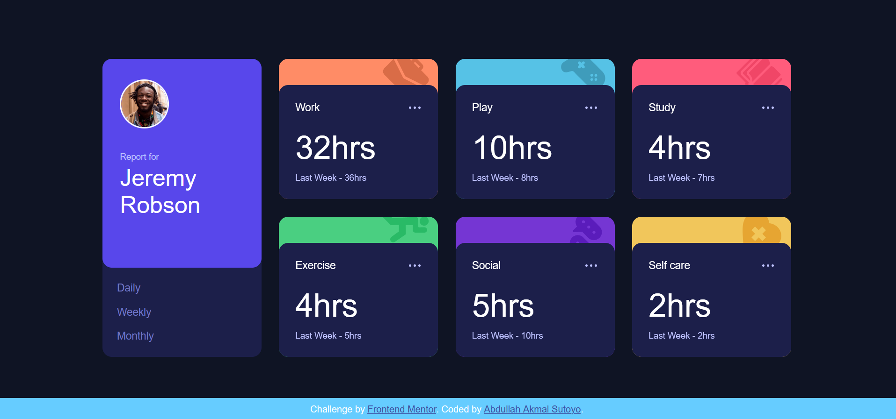

# Quiz 2 - Time tracking dashboard solution

This is a solution to the [Time tracking dashboard Quiz 2 challenge]

## Table of contents

- [Overview](#overview)
  - [The challenge](#the-challenge)
  - [Screenshot](#screenshot)
  - [Links](#links)
- [My process](#my-process)
  - [Built with](#built-with)
  - [What I learned](#what-i-learned)

**Note: Delete this note and update the table of contents based on what sections you keep.**

## Overview

### The challenge

Users should be able to:

- View the optimal layout for the site depending on their device's screen size
- See hover states for all interactive elements on the page
- Switch between viewing Daily, Weekly, and Monthly stats

### Screenshot

### Links

- Solution URL: [Add solution URL here](https://github.com/ilovegaming42069/time-tracking-dashboard-main)
- Live Site URL: [Add live site URL here]( https://ilovegaming42069.github.io/time-tracking-dashboard-main)

## My process

First, i divided the sections of the HTML given by Sir Bagus, and then i designed the website using CSS so that the design is optimal. However, i find using Jquery and Javascript very hard to do, and it didn't even work.

### Built with

- HTML
- CSS
- Jquery

### What I learned

Today i learned that i am still struggling to use Jquery and Javascript. In the future, i have to improve my skills in this area

## Your Detail 

- FullName - Abdullah Akmal Sutoyo
- StudentID - 2602239320
- BINUS Email - abdullah.sutoyo@binus.ac.id

**Note: Delete this note and add/remove/edit lines above based on what links you'd like to share.**

## Acknowledgments

Special thanks to Nathan Darrien Tanner, Carlo Nathanael Bessie, and Adyatama Mahabarata for helping me.

